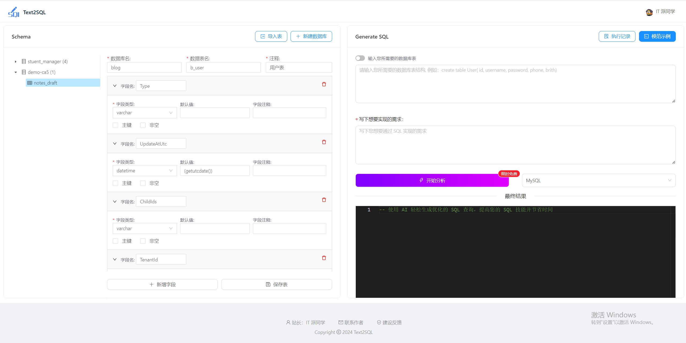
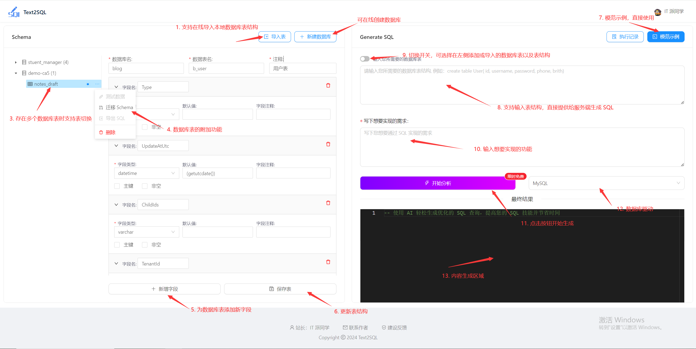
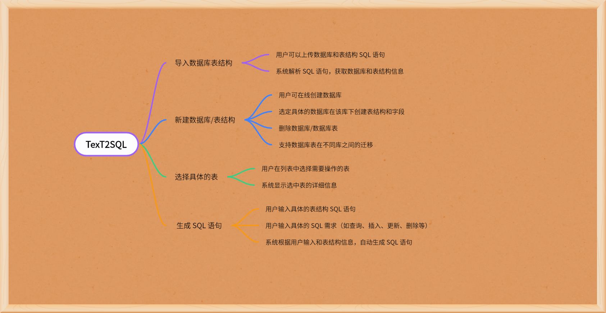

  

<h2 align="center">👨‍💻 Text2SQL</h2>
 

     使用 AI 轻松生成优化的 SQL 查询，提高您的 SQL 技能并节省时间
      
	🔥 Easily generate optimized SQL queries using AI, improve your SQL skills and save time 📜

> 🥳 前后端全栈项目 Created By IT 派同学
>
> 🙌 抢先体验:  http://www.ai-thesis.cc

<h2>Text2SQL - 用户交互主页</h2>

<h2>项目简介</h2>

项目目录展现：

| 子项目                                                       | 描述                    | 目录地址                                                     |
| ------------------------------------------------------------ | ----------------------- | ------------------------------------------------------------ |
| <a href="https://github.com/pdxjie/text2sql-v1.0/tree/master/text2sql-web">🛸Text2SQL 视图端</a> | NL2SQL 用户交互视图     | <a href="https://github.com/pdxjie/text2sql-v1.0/tree/master/text2sql-web">text2sql-web</a> |
| <a href="https://github.com/pdxjie/text2sql-v1.0/tree/master/text2sql-api">🛰️ Text2SQL 服务端</a> | NL2SQL 核心业务实现逻辑 | <a href="https://github.com/pdxjie/text2sql-v1.0/tree/master/text2sql-api">text2sql-api</a> |

TexT2SQL 支持用户输入的表结构和需求，**从而神奇地生成具体的 SQL 语句！**并且可以导入数据库和表结构，选择具体的表，生成独特的 SQL 语句。致力于解放开发同学的双手，扎根于更深层次的业务中。

<h2>TexT2SQL 是什么？</h2>

TexT2SQL 的目的是让开发人员轻松生成 SQL 语句，从此摆脱编写 SQL 的支配感！用聊天的方式来完成功能的实现，全程无脑式操作即可，早早打卡下班~

此外，它不仅可以帮助我们实现 SQL 的编写，而且在输出我们想要的 SQL 之后，还会为这条 SQL 提供一些优化建议，帮助我们以最优的性能完成任务！

> 我相信，作为一名开发同学，你会爱上它！🍻

<h2>1 分钟上手 TexT2SQL</h2>

首先请前往目标网站：http://www.ai-thesis.cc

> 🎈 更多功能，请尽情探索 ~

<h2>平台优势</h2>

- 对话式流程、无脑式操作
- 降低工作中被 SQL 支配的破碎感
- 可大大提升工作效率
- 提供优化 SQL 建议
- 降低学习成本
- 支持多数据源
- 完全免费 🔥

> 🪐 用合适的技术，写出最优质的代码 🪐

<h2>技术栈</h2>

**前端**

- Vue2
- Node > 14
- Ant Design Vue UI 组件库
- Axios 网络请求库
- Eslint 代码规范控制
- fetch-event-source  实现 SSE 流式
- Monaco Editor 代码编辑器
- SQL Formatter SQL 格式化库
- Vuex 状态管理
- Others ....

**后端**

- SpringBoot 2.5.x
- MySQL 8.x
- MyBatis Plus
- FastJson
- Hutool 工具包
- 阿里云 OSS
- OkHttp
- OpenAI
- Others ...

<h2>功能结构流程图</h2>

<h2>为什么要开发该平台?</h2>

1. 开源的 NL2SQL 相关的平台少之又少，也算是为开源贡献一份力量！
2. 帮助自己高效的完成后续任务，同样也可以帮助到其他同学，早早下班，拒绝无效内卷！
3. 本来想使用现已有的成品，但是奈何使用不习惯，可能是自己电脑原因，使用过程中总是卡顿，头大，而且习惯了使用 Navicat，不想再更换其他工具！
4. 拥抱 AI，自己造轮子！

<h2>贡献指南</h2>

首先，欢迎各位开发大佬们贡献代码，一起维护该项目！

如想要为 TexT2SQL 新增一些更强大的功能或维护一些现有的缺陷的话，还请遵循如下规范：

- 分支管理
    - 功能分支：feature/xxx_xxx
    - 修复分支：fix/xxx_xxx
- 注释规范
    - 注释是为了描述业务，应当简洁明了，并非生硬的翻译代码
- 其他规范
    - 方法返回空集合，请使用 `Collections.emptyList(List<T> list)`
    - 对集合进行判空，请使用 `Collections.isEmpty(List<T> list)`
    - 变量名需要能够表达其意：
        - 正例：`int count、boolean isDeleted`
        - 反例：`int i、boolean flag`
    - 字符串比较为避免空指针异常的出现，请使用常量或确定有值的对象调用 `equals` 方法
- 测试验证通过后，可以发起 PR 等 IT 派同学合并

<h2>结语</h2>

如果这个项目对你有帮助或者你觉得它很有趣，就请点个 star 支持一下吧！⭐️

<h2>联系作者</h2>

